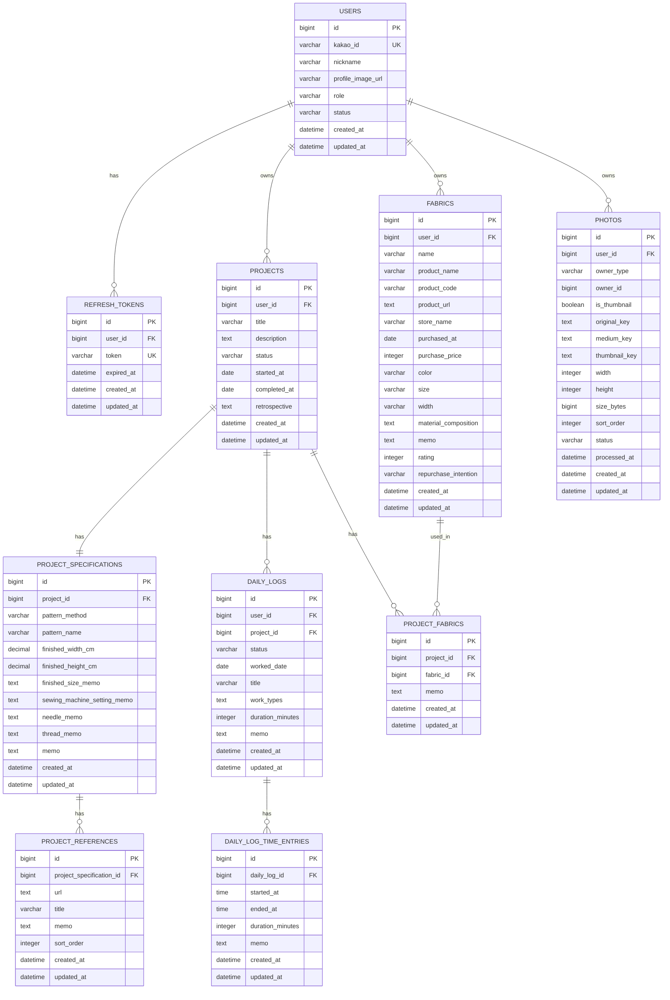

# 04. ERD — 소로소로(SOROSORO)

> 소로소로의 핵심 도메인과 데이터베이스 테이블 구조를 정의하는 문서

---

# 1. 문서 개요

## 1.1 문서 목적

이 문서는 소로소로(SOROSORO)의 데이터 모델과 테이블 구조를 정의한다.

소로소로는 개인 재봉 기록 서비스로, 사용자가 재봉 작품, 작업 일지, 원단, 사진을 기록하고 이를 캘린더와 재봉 잔디로 확인할 수 있도록 한다.

본 문서에서는 다음 내용을 정의한다.

- 핵심 엔티티
    
- 엔티티 간 관계
    
- 테이블 구조
    
- 주요 제약조건
    
- 인덱스 설계
    
- 삭제 정책
    
- 상태값 정의
    
- 향후 확장 여지
    

---

## 1.2 문서 범위

본 ERD 문서는 MVP 범위를 기준으로 작성한다.

MVP에 포함되는 도메인은 다음과 같다.

- User
    
- RefreshToken
    
- Project
    
- ProjectSpecification
    
- ProjectReference
    
- DailyLog
    
- DailyLogTimeEntry
    
- Fabric
    
- ProjectFabric
    
- Photo
    

MVP에서 제외되는 도메인은 다음과 같다.

- AI 기반 원단 자동 기록
    
- FabricExtractionJob
    
- ExtractedFabricItem
    
- Community
    
- Comment
    
- Like
    
- Follow
    
- Notification
    
- Statistics Dashboard
    
- Fabric Inventory
    
- Pattern / Supply 관리
    

---

# 2. 전체 도메인 관계

소로소로의 핵심 도메인 관계는 다음과 같다.

```text
User
 ├── RefreshToken
 ├── Project
 │    ├── ProjectSpecification
 │    │    └── ProjectReference
 │    ├── DailyLog
 │    │    └── DailyLogTimeEntry
 │    └── ProjectFabric
 │         └── Fabric
 │
 ├── Fabric
 └── Photo
```

---

## 2.1 관계 요약

|관계|설명|
|---|---|
|User 1 : N Project|한 사용자는 여러 Project를 가진다.|
|User 1 : N Fabric|한 사용자는 여러 Fabric을 가진다.|
|User 1 : N Photo|한 사용자는 여러 Photo를 가진다.|
|User 1 : N RefreshToken|한 사용자는 여러 RefreshToken을 가질 수 있다.|
|Project 1 : 1 ProjectSpecification|하나의 Project는 하나의 제작 설정을 가진다.|
|ProjectSpecification 1 : N ProjectReference|하나의 제작 설정은 여러 참고 URL을 가진다.|
|Project 1 : N DailyLog|하나의 Project는 여러 DailyLog를 가진다.|
|DailyLog 1 : N DailyLogTimeEntry|하나의 DailyLog는 여러 작업 시간 구간을 가진다.|
|Project N : M Fabric|Project와 Fabric은 ProjectFabric을 통해 다대다 관계를 가진다.|
|Project 1 : N ProjectFabric|하나의 Project는 여러 Fabric 연결을 가진다.|
|Fabric 1 : N ProjectFabric|하나의 Fabric은 여러 Project에 연결될 수 있다.|
|Photo N : 1 Owner|Photo는 Project, DailyLog, Fabric 중 하나에 연결된다.|

---

# 3. ERD Diagram

## 3.1 Mermaid ERD



---

# 4. 테이블 상세

---

# 4.1 users

## 4.1.1 설명

`users`는 소로소로의 사용자 정보를 저장하는 테이블이다.

MVP에서는 카카오 로그인을 기준으로 사용자를 식별한다.

---

## 4.1.2 컬럼

|컬럼명|타입|Null|Key|설명|
|---|---|--:|---|---|
|id|BIGSERIAL|N|PK|사용자 ID|
|kakao_id|VARCHAR(100)|N|UK|카카오 사용자 식별자|
|nickname|VARCHAR(100)|Y||사용자 닉네임|
|profile_image_url|TEXT|Y||카카오 프로필 이미지 URL|
|role|VARCHAR(30)|N||사용자 권한|
|status|VARCHAR(30)|N||사용자 상태|
|created_at|TIMESTAMP|N||생성 일시|
|updated_at|TIMESTAMP|N||수정 일시|

---

## 4.1.3 상태값

### UserRole

|값|설명|
|---|---|
|USER|일반 사용자|
|ADMIN|관리자|

MVP에서는 `USER`만 사용한다.

### UserStatus

|값|설명|
|---|---|
|ACTIVE|활성 사용자|
|DELETED|탈퇴 사용자|

---

## 4.1.4 제약조건

|제약조건|설명|
|---|---|
|PK_users|id 기본키|
|UK_users_kakao_id|kakao_id unique|
|NN_users_kakao_id|kakao_id not null|
|NN_users_role|role not null|
|NN_users_status|status not null|

---

# 4.2 refresh_tokens

## 4.2.1 설명

`refresh_tokens`는 로그인 유지와 Access Token 재발급을 위한 Refresh Token을 저장하는 테이블이다.

---

## 4.2.2 컬럼

|컬럼명|타입|Null|Key|설명|
|---|---|--:|---|---|
|id|BIGSERIAL|N|PK|RefreshToken ID|
|user_id|BIGINT|N|FK|사용자 ID|
|token|TEXT|N|UK|Refresh Token 값|
|expired_at|TIMESTAMP|N||만료 일시|
|created_at|TIMESTAMP|N||생성 일시|
|updated_at|TIMESTAMP|N||수정 일시|

---

## 4.2.3 제약조건

|제약조건|설명|
|---|---|
|PK_refresh_tokens|id 기본키|
|FK_refresh_tokens_user_id|user_id → users.id|
|UK_refresh_tokens_token|token unique|
|NN_refresh_tokens_user_id|user_id not null|
|NN_refresh_tokens_token|token not null|
|NN_refresh_tokens_expired_at|expired_at not null|

---

## 4.2.4 삭제 정책

|상황|처리|
|---|---|
|로그아웃|현재 RefreshToken 삭제|
|회원 탈퇴|해당 User의 RefreshToken 삭제|
|만료 Token 정리|expired_at 기준 삭제 가능|

---

# 4.3 projects

## 4.3.1 설명

`projects`는 사용자가 제작하는 하나의 재봉 작품을 저장하는 테이블이다.

Project는 원단, 작업 일지, 사진을 연결하는 중심 도메인이다.

---

## 4.3.2 컬럼

|컬럼명|타입|Null|Key|설명|
|---|---|--:|---|---|
|id|BIGSERIAL|N|PK|Project ID|
|user_id|BIGINT|N|FK|사용자 ID|
|title|VARCHAR(150)|N||Project 제목|
|description|TEXT|Y||Project 설명|
|status|VARCHAR(30)|N||Project 상태|
|started_at|DATE|Y||시작일|
|completed_at|DATE|Y||완료일|
|retrospective|TEXT|Y||회고|
|created_at|TIMESTAMP|N||생성 일시|
|updated_at|TIMESTAMP|N||수정 일시|

---

## 4.3.3 상태값

### ProjectStatus

|값|설명|
|---|---|
|IN_PROGRESS|진행 중|
|ON_HOLD|보류|
|COMPLETED|완료|
|ARCHIVED|보관|

---

## 4.3.4 제약조건

|제약조건|설명|
|---|---|
|PK_projects|id 기본키|
|FK_projects_user_id|user_id → users.id|
|NN_projects_user_id|user_id not null|
|NN_projects_title|title not null|
|NN_projects_status|status not null|

---

## 4.3.5 비즈니스 규칙

- Project는 title만으로 생성할 수 있다.
    
- Project에는 DRAFT 상태를 두지 않는다.
    
- Project가 `ARCHIVED`이면 다음 작업을 제한한다.
    
    - Project 기본 정보 수정
        
    - DailyLog 생성
        
    - DailyLog 수정
        
    - DailyLog 삭제
        
    - DailyLog 발행
        
    - Fabric 연결
        
    - Fabric 연결 수정
        
    - Fabric 연결 삭제
        
    - Photo 추가
        
    - Photo 삭제
        
    - 대표 Photo 설정
        
- Project가 `ARCHIVED`여도 조회와 상태 변경은 가능하다.
    
- Project가 `ON_HOLD`여도 DailyLog 작성은 가능하다.
    

---

# 4.4 project_specifications

## 4.4.1 설명

`project_specifications`는 Project의 제작 설정 정보를 저장하는 테이블이다.

패턴 방식, 완성 크기, 재봉틀 설정, 바늘, 실 등 작품 제작에 필요한 상세 정보를 기록한다.

---

## 4.4.2 컬럼

|컬럼명|타입|Null|Key|설명|
|---|---|--:|---|---|
|id|BIGSERIAL|N|PK|ProjectSpecification ID|
|project_id|BIGINT|N|FK, UK|Project ID|
|pattern_method|VARCHAR(30)|Y||패턴 제작 방식|
|pattern_name|VARCHAR(150)|Y||패턴명|
|finished_width_cm|NUMERIC(6,2)|Y||완성 가로 길이|
|finished_height_cm|NUMERIC(6,2)|Y||완성 세로 길이|
|finished_size_memo|TEXT|Y||완성 크기 메모|
|sewing_machine_setting_memo|TEXT|Y||재봉틀 설정 메모|
|needle_memo|TEXT|Y||바늘 메모|
|thread_memo|TEXT|Y||실 메모|
|memo|TEXT|Y||기타 메모|
|created_at|TIMESTAMP|N||생성 일시|
|updated_at|TIMESTAMP|N||수정 일시|

---

## 4.4.3 상태값

### PatternMethod

|값|설명|
|---|---|
|SELF_DRAFTED|직접 제도|
|COPIED|기존 패턴 사용|
|MODIFIED|기존 패턴 변형|

---

## 4.4.4 제약조건

|제약조건|설명|
|---|---|
|PK_project_specifications|id 기본키|
|FK_project_specifications_project_id|project_id → projects.id|
|UK_project_specifications_project_id|project_id unique|
|NN_project_specifications_project_id|project_id not null|

---

## 4.4.5 비즈니스 규칙

- 하나의 Project는 하나의 ProjectSpecification만 가진다.
    
- Project 생성 시 빈 ProjectSpecification을 함께 생성할 수 있다.
    
- ProjectSpecification은 Project와 생명주기를 같이한다.
    
- Project 삭제 시 ProjectSpecification도 삭제된다.
    

---

# 4.5 project_references

## 4.5.1 설명

`project_references`는 Project 제작 시 참고한 URL 정보를 저장하는 테이블이다.

예를 들어 다음 정보를 기록할 수 있다.

- 블로그 글
    
- 유튜브 영상
    
- 쇼핑몰 상품 페이지
    
- 패턴 참고 링크
    
- 제작 튜토리얼
    

---

## 4.5.2 컬럼

|컬럼명|타입|Null|Key|설명|
|---|---|--:|---|---|
|id|BIGSERIAL|N|PK|ProjectReference ID|
|project_specification_id|BIGINT|N|FK|ProjectSpecification ID|
|url|TEXT|N||참고 URL|
|title|VARCHAR(200)|Y||참고자료 제목|
|memo|TEXT|Y||메모|
|sort_order|INTEGER|N||정렬 순서|
|created_at|TIMESTAMP|N||생성 일시|
|updated_at|TIMESTAMP|N||수정 일시|

---

## 4.5.3 제약조건

|제약조건|설명|
|---|---|
|PK_project_references|id 기본키|
|FK_project_references_project_specification_id|project_specification_id → project_specifications.id|
|NN_project_references_project_specification_id|project_specification_id not null|
|NN_project_references_url|url not null|
|NN_project_references_sort_order|sort_order not null|

---

## 4.5.4 비즈니스 규칙

- 하나의 ProjectSpecification은 여러 ProjectReference를 가질 수 있다.
    
- ProjectReference는 sortOrder 기준으로 정렬한다.
    
- Project 삭제 시 ProjectSpecification과 ProjectReference도 함께 삭제된다.
    

---

# 4.6 daily_logs

## 4.6.1 설명

`daily_logs`는 특정 Project에 대한 날짜별 작업 일지를 저장하는 테이블이다.

DailyLog는 사용자의 실제 작업 과정을 기록하는 핵심 엔티티이며, Calendar와 Contribution의 원본 데이터가 된다.

---

## 4.6.2 컬럼

|컬럼명|타입|Null|Key|설명|
|---|---|--:|---|---|
|id|BIGSERIAL|N|PK|DailyLog ID|
|user_id|BIGINT|N|FK|사용자 ID|
|project_id|BIGINT|N|FK|Project ID|
|status|VARCHAR(30)|N||DailyLog 상태|
|worked_date|DATE|Y||작업 날짜|
|title|VARCHAR(150)|Y||DailyLog 제목|
|work_types|TEXT|Y||작업 종류 목록|
|duration_minutes|INTEGER|N||총 작업 시간|
|memo|TEXT|Y||작업 메모|
|created_at|TIMESTAMP|N||생성 일시|
|updated_at|TIMESTAMP|N||수정 일시|

---

## 4.6.3 상태값

### DailyLogStatus

|값|설명|
|---|---|
|DRAFT|임시저장|
|PUBLISHED|정식 기록|

---

## 4.6.4 WorkType

DailyLog는 여러 작업 종류를 가질 수 있다.

|값|설명|
|---|---|
|PATTERN_DRAFTING|패턴 제도|
|CUTTING|재단|
|INTERFACING|심지 작업|
|SEWING|재봉|
|PRESSING|다림질|
|FITTING|피팅|
|FIXING|수정|
|FINISHING|마감|
|ETC|기타|

MVP에서는 `work_types`를 문자열 목록 형태로 저장한다.

예시는 다음과 같다.

```text
["CUTTING", "SEWING"]
```

실제 저장 방식은 Backend Design에서 다음 중 하나로 결정한다.

- TEXT에 JSON 문자열 저장
    
- PostgreSQL ARRAY 사용
    
- 별도 DailyLogWorkType 테이블 사용
    

MVP에서는 구현 단순성을 위해 TEXT 또는 ARRAY를 우선 검토한다.

---

## 4.6.5 제약조건

|제약조건|설명|
|---|---|
|PK_daily_logs|id 기본키|
|FK_daily_logs_user_id|user_id → users.id|
|FK_daily_logs_project_id|project_id → projects.id|
|NN_daily_logs_user_id|user_id not null|
|NN_daily_logs_project_id|project_id not null|
|NN_daily_logs_status|status not null|
|NN_daily_logs_duration_minutes|duration_minutes not null|

---

## 4.6.6 비즈니스 규칙

- DailyLog는 반드시 User와 Project에 속한다.
    
- DailyLog는 `DRAFT` 또는 `PUBLISHED` 상태를 가진다.
    
- DRAFT DailyLog는 workedDate 없이 저장할 수 있다.
    
- DRAFT DailyLog는 TimeEntry 없이 저장할 수 있다.
    
- DRAFT DailyLog는 Calendar와 Contribution에 포함하지 않는다.
    
- PUBLISHED DailyLog는 workedDate가 필수이다.
    
- PUBLISHED DailyLog는 TimeEntry가 1개 이상 필요하다.
    
- PUBLISHED DailyLog는 Calendar와 Contribution에 포함한다.
    
- PUBLISHED DailyLog도 수정 가능하다.
    
- PUBLISHED → DRAFT 전환은 MVP에서 제공하지 않는다.
    
- DailyLog.durationMinutes는 DailyLogTimeEntry.durationMinutes 합산값이다.
    
- Project가 ARCHIVED 상태이면 DailyLog 생성, 수정, 삭제, 발행을 제한한다.
    

---

# 4.7 daily_log_time_entries

## 4.7.1 설명

`daily_log_time_entries`는 DailyLog의 작업 시간 구간을 저장하는 테이블이다.

하나의 DailyLog는 여러 작업 시간 구간을 가질 수 있다.

---

## 4.7.2 컬럼

|컬럼명|타입|Null|Key|설명|
|---|---|--:|---|---|
|id|BIGSERIAL|N|PK|TimeEntry ID|
|daily_log_id|BIGINT|N|FK|DailyLog ID|
|started_at|TIME|N||작업 시작 시각|
|ended_at|TIME|N||작업 종료 시각|
|duration_minutes|INTEGER|N||작업 시간|
|memo|TEXT|Y||시간 구간 메모|
|created_at|TIMESTAMP|N||생성 일시|
|updated_at|TIMESTAMP|N||수정 일시|

---

## 4.7.3 제약조건

|제약조건|설명|
|---|---|
|PK_daily_log_time_entries|id 기본키|
|FK_daily_log_time_entries_daily_log_id|daily_log_id → daily_logs.id|
|NN_daily_log_time_entries_daily_log_id|daily_log_id not null|
|NN_daily_log_time_entries_started_at|started_at not null|
|NN_daily_log_time_entries_ended_at|ended_at not null|
|NN_daily_log_time_entries_duration_minutes|duration_minutes not null|
|CK_daily_log_time_entries_time_range|ended_at > started_at|
|CK_daily_log_time_entries_duration_positive|duration_minutes > 0|

---

## 4.7.4 비즈니스 규칙

- TimeEntry는 반드시 DailyLog에 속한다.
    
- endedAt은 startedAt보다 늦어야 한다.
    
- durationMinutes는 endedAt - startedAt으로 계산한다.
    
- DailyLog.durationMinutes는 TimeEntry durationMinutes의 합산값이다.
    
- MVP에서는 TimeEntry 개별 수정 API를 제공하지 않는다.
    
- DailyLog 수정 요청 안에서 TimeEntry 목록을 전체 교체한다.
    

---

# 4.8 fabrics

## 4.8.1 설명

`fabrics`는 사용자가 구매하거나 보유한 원단 정보를 저장하는 테이블이다.

Fabric은 Project와 독립적으로 존재할 수 있으며, ProjectFabric을 통해 여러 Project에 연결될 수 있다.

---

## 4.8.2 컬럼

|컬럼명|타입|Null|Key|설명|
|---|---|--:|---|---|
|id|BIGSERIAL|N|PK|Fabric ID|
|user_id|BIGINT|N|FK|사용자 ID|
|name|VARCHAR(150)|N||사용자가 부르는 원단명|
|product_name|VARCHAR(200)|Y||쇼핑몰 상품명|
|product_code|VARCHAR(100)|Y||품번|
|product_url|TEXT|Y||상품 URL|
|store_name|VARCHAR(150)|Y||구매처|
|purchased_at|DATE|Y||구매일|
|purchase_price|INTEGER|Y||구매 가격|
|color|VARCHAR(100)|Y||색상|
|size|VARCHAR(100)|Y||구매 규격|
|width|VARCHAR(100)|Y||원단폭|
|material_composition|TEXT|Y||혼용률 또는 소재|
|memo|TEXT|Y||원단 메모|
|rating|INTEGER|Y||사용자 평점|
|repurchase_intention|VARCHAR(30)|N||재구매 의사|
|created_at|TIMESTAMP|N||생성 일시|
|updated_at|TIMESTAMP|N||수정 일시|

---

## 4.8.3 상태값

### RepurchaseIntention

|값|설명|
|---|---|
|YES|재구매 의사 있음|
|NO|재구매 의사 없음|
|UNKNOWN|미정|

---

## 4.8.4 제약조건

|제약조건|설명|
|---|---|
|PK_fabrics|id 기본키|
|FK_fabrics_user_id|user_id → users.id|
|NN_fabrics_user_id|user_id not null|
|NN_fabrics_name|name not null|
|NN_fabrics_repurchase_intention|repurchase_intention not null|
|CK_fabrics_rating_range|rating between 1 and 5|

---

## 4.8.5 비즈니스 규칙

- Fabric은 반드시 User에 속한다.
    
- Fabric은 Project 없이도 생성할 수 있다.
    
- 같은 productCode를 가진 Fabric이라도 구매일, 구매처, 구매 가격이 다르면 별도 Fabric으로 등록할 수 있다.
    
- Fabric 삭제 시 Project는 삭제되지 않는다.
    
- Fabric 삭제 시 연결된 ProjectFabric은 삭제된다.
    
- Fabric은 최대 2장의 Photo를 가질 수 있다.
    
- Fabric은 별도 대표 사진 설정 기능을 제공하지 않는다.
    
- Fabric 목록에서는 sortOrder가 가장 앞선 Photo를 대표 이미지처럼 사용할 수 있다.
    
- MVP에서는 AI 추출 관련 필드를 두지 않는다.
    

---

# 4.9 project_fabrics

## 4.9.1 설명

`project_fabrics`는 Project와 Fabric의 연결 관계를 저장하는 테이블이다.

단순 Join Table이 아니라, Project에서 해당 Fabric을 사용한 맥락을 기록하는 연결 엔티티이다.

---

## 4.9.2 컬럼

|컬럼명|타입|Null|Key|설명|
|---|---|--:|---|---|
|id|BIGSERIAL|N|PK|ProjectFabric ID|
|project_id|BIGINT|N|FK|Project ID|
|fabric_id|BIGINT|N|FK|Fabric ID|
|memo|TEXT|Y||Project에서 해당 Fabric을 사용한 메모|
|created_at|TIMESTAMP|N||생성 일시|
|updated_at|TIMESTAMP|N||수정 일시|

---

## 4.9.3 제약조건

|제약조건|설명|
|---|---|
|PK_project_fabrics|id 기본키|
|FK_project_fabrics_project_id|project_id → projects.id|
|FK_project_fabrics_fabric_id|fabric_id → fabrics.id|
|NN_project_fabrics_project_id|project_id not null|
|NN_project_fabrics_fabric_id|fabric_id not null|
|UK_project_fabrics_project_id_fabric_id|project_id, fabric_id unique|

---

## 4.9.4 비즈니스 규칙

- 하나의 Project는 여러 Fabric을 연결할 수 있다.
    
- 하나의 Fabric은 여러 Project에 연결될 수 있다.
    
- 동일 Project에 동일 Fabric은 중복 연결할 수 없다.
    
- ProjectFabric은 memo를 가질 수 있다.
    
- Project 삭제 시 ProjectFabric은 삭제된다.
    
- Fabric 삭제 시 ProjectFabric은 삭제된다.
    
- ProjectFabric 삭제 시 Project와 Fabric은 유지된다.
    
- Project가 ARCHIVED 상태이면 ProjectFabric 생성, 수정, 삭제를 제한한다.
    
- ProjectFabric 생성 시 Project와 Fabric이 모두 현재 User 소유인지 검증해야 한다.
    

---

# 4.10 photos

## 4.10.1 설명

`photos`는 Project, DailyLog, Fabric에서 공통으로 사용하는 이미지 정보를 저장하는 테이블이다.

Photo는 실제 이미지 파일을 DB에 저장하지 않고, S3 Object Key와 이미지 처리 상태를 저장한다.

---

## 4.10.2 컬럼

|컬럼명|타입|Null|Key|설명|
|---|---|--:|---|---|
|id|BIGSERIAL|N|PK|Photo ID|
|user_id|BIGINT|N|FK|사용자 ID|
|owner_type|VARCHAR(30)|N||연결 대상 타입|
|owner_id|BIGINT|N||연결 대상 ID|
|is_thumbnail|BOOLEAN|N||대표 사진 여부|
|original_key|TEXT|N||원본 이미지 S3 Key|
|medium_key|TEXT|Y||Medium 이미지 S3 Key|
|thumbnail_key|TEXT|Y||Thumbnail 이미지 S3 Key|
|width|INTEGER|Y||원본 이미지 너비|
|height|INTEGER|Y||원본 이미지 높이|
|size_bytes|BIGINT|Y||파일 크기|
|sort_order|INTEGER|N||표시 순서|
|status|VARCHAR(30)|N||이미지 상태|
|processed_at|TIMESTAMP|Y||이미지 처리 완료 일시|
|created_at|TIMESTAMP|N||생성 일시|
|updated_at|TIMESTAMP|N||수정 일시|

---

## 4.10.3 상태값

### PhotoOwnerType

|값|설명|
|---|---|
|PROJECT|Project에 연결된 사진|
|DAILY_LOG|DailyLog에 연결된 사진|
|FABRIC|Fabric에 연결된 사진|

### PhotoStatus

|값|설명|
|---|---|
|UPLOADING|Presigned URL 발급 후 원본 업로드 대기 또는 진행 중|
|PROCESSING|원본 업로드 완료 후 이미지 변환 중|
|READY|이미지 변환 완료|
|FAILED|이미지 처리 실패|

---

## 4.10.4 제약조건

|제약조건|설명|
|---|---|
|PK_photos|id 기본키|
|FK_photos_user_id|user_id → users.id|
|NN_photos_user_id|user_id not null|
|NN_photos_owner_type|owner_type not null|
|NN_photos_owner_id|owner_id not null|
|NN_photos_is_thumbnail|is_thumbnail not null|
|NN_photos_original_key|original_key not null|
|NN_photos_sort_order|sort_order not null|
|NN_photos_status|status not null|

---

## 4.10.5 ownerType별 정책

|ownerType|최대 사진 수|대표 사진|
|---|--:|---|
|PROJECT|15장|1장 가능|
|DAILY_LOG|15장|1장 가능|
|FABRIC|2장|별도 대표 설정 없음|

---

## 4.10.6 비즈니스 규칙

- Photo는 반드시 User에 속한다.
    
- Photo는 Project, DailyLog, Fabric 중 하나에 연결된다.
    
- Photo 연결은 ownerType과 ownerId로 표현한다.
    
- ownerType/ownerId의 실제 존재 여부는 Service 계층에서 검증한다.
    
- owner 소유권도 Service 계층에서 검증한다.
    
- READY 상태가 아닌 Photo는 정상 이미지 URL을 제공하지 않는다.
    
- Project와 DailyLog는 대표 사진을 1장만 가질 수 있다.
    
- Fabric은 대표 사진 설정 기능을 제공하지 않는다.
    
- Fabric 목록에서는 sortOrder가 가장 앞선 Photo를 대표 이미지처럼 사용할 수 있다.
    
- Presigned URL 발급 시 Photo는 UPLOADING 상태로 생성된다.
    
- 업로드 완료 처리 시 Photo는 PROCESSING 상태가 된다.
    
- Worker 처리 성공 시 READY 상태가 된다.
    
- Worker 처리 실패 시 FAILED 상태가 된다.
    

---

# 5. 주요 제약조건 정리

## 5.1 Unique 제약조건

|테이블|컬럼|설명|
|---|---|---|
|users|kakao_id|카카오 사용자 식별자 중복 방지|
|refresh_tokens|token|Refresh Token 중복 방지|
|project_specifications|project_id|Project당 Specification 1개 보장|
|project_fabrics|project_id, fabric_id|동일 Project-Fabric 중복 연결 방지|

---

## 5.2 Foreign Key 제약조건

|테이블|컬럼|참조|
|---|---|---|
|refresh_tokens|user_id|users.id|
|projects|user_id|users.id|
|project_specifications|project_id|projects.id|
|project_references|project_specification_id|project_specifications.id|
|daily_logs|user_id|users.id|
|daily_logs|project_id|projects.id|
|daily_log_time_entries|daily_log_id|daily_logs.id|
|fabrics|user_id|users.id|
|project_fabrics|project_id|projects.id|
|project_fabrics|fabric_id|fabrics.id|
|photos|user_id|users.id|

Photo의 `owner_id`는 ownerType에 따라 Project, DailyLog, Fabric 중 하나를 참조한다.

다만 DB 레벨 FK를 직접 걸지 않고, Service 계층에서 owner 존재 여부와 소유권을 검증한다.

---

## 5.3 Check 제약조건 후보

|테이블|제약조건|설명|
|---|---|---|
|daily_log_time_entries|ended_at > started_at|종료 시각은 시작 시각보다 늦어야 한다.|
|daily_log_time_entries|duration_minutes > 0|작업 시간은 0보다 커야 한다.|
|fabrics|rating between 1 and 5|평점은 1~5 범위이다.|
|photos|sort_order >= 0|정렬 순서는 0 이상이다.|
|projects|completed_at >= started_at|완료일은 시작일보다 빠를 수 없다.|

---

# 6. 인덱스 설계

## 6.1 기본 인덱스

Primary Key와 Unique Key에는 자동으로 인덱스가 생성된다.

---

## 6.2 조회 성능을 위한 인덱스 후보

|테이블|인덱스|목적|
|---|---|---|
|projects|user_id, status|사용자별 Project 목록 조회|
|projects|user_id, created_at|사용자별 최신 Project 조회|
|daily_logs|user_id, status, worked_date|Calendar, Contribution 조회|
|daily_logs|project_id, status, worked_date|Project별 DailyLog 조회|
|daily_log_time_entries|daily_log_id|DailyLog 상세 조회|
|fabrics|user_id, created_at|사용자별 Fabric 목록 조회|
|fabrics|user_id, store_name|구매처 필터|
|fabrics|user_id, product_code|품번 검색|
|project_fabrics|project_id|Project 상세에서 Fabric 목록 조회|
|project_fabrics|fabric_id|Fabric 상세에서 사용 Project 조회|
|photos|owner_type, owner_id, sort_order|owner별 Photo 목록 조회|
|photos|user_id, status|사용자별 Photo 상태 조회|
|refresh_tokens|user_id|사용자별 RefreshToken 조회|

---

## 6.3 Calendar/Contribution 핵심 인덱스

Calendar와 Contribution은 PUBLISHED DailyLog를 날짜 기준으로 집계한다.

따라서 다음 인덱스가 중요하다.

```sql
CREATE INDEX idx_daily_logs_user_status_worked_date
ON daily_logs (user_id, status, worked_date);
```

Project 상세 내 DailyLog 조회를 위해 다음 인덱스를 고려한다.

```sql
CREATE INDEX idx_daily_logs_project_status_worked_date
ON daily_logs (project_id, status, worked_date);
```

---

# 7. 삭제 정책

## 7.1 User 삭제

MVP에서는 물리 삭제보다 상태 변경을 우선한다.

|대상|처리|
|---|---|
|users|status = DELETED|
|refresh_tokens|삭제|
|projects|유지 또는 별도 정책 필요|
|fabrics|유지 또는 별도 정책 필요|
|photos|유지 또는 별도 정책 필요|

회원 탈퇴 시 데이터 완전 삭제 정책은 개인정보 처리 기준에 따라 Backend Design에서 별도로 정의한다.

---

## 7.2 Project 삭제

|대상|처리|
|---|---|
|project|삭제|
|project_specification|삭제|
|project_references|삭제|
|daily_logs|삭제|
|daily_log_time_entries|삭제|
|project_fabrics|삭제|
|fabrics|유지|
|photos ownerType=PROJECT|삭제 또는 삭제 예정 처리|
|photos ownerType=DAILY_LOG|삭제 또는 삭제 예정 처리|

Project 삭제 시 Fabric 자체는 삭제하지 않는다.

---

## 7.3 Fabric 삭제

|대상|처리|
|---|---|
|fabric|삭제|
|project_fabrics|삭제|
|projects|유지|
|photos ownerType=FABRIC|삭제 또는 삭제 예정 처리|

Fabric 삭제 시 Project 자체는 삭제하지 않는다.

---

## 7.4 DailyLog 삭제

|대상|처리|
|---|---|
|daily_log|삭제|
|daily_log_time_entries|삭제|
|photos ownerType=DAILY_LOG|삭제 또는 삭제 예정 처리|
|project|유지|

---

## 7.5 Photo 삭제

Photo 삭제 시 DB row와 S3 object 처리 정책을 분리한다.

MVP에서는 다음 중 하나를 선택할 수 있다.

|방식|설명|
|---|---|
|즉시 삭제|DB row 삭제와 S3 object 삭제를 즉시 수행|
|지연 삭제|DB에서 삭제 처리 후 Worker가 S3 object 삭제|
|Soft Delete|deletedAt을 두고 일정 기간 후 삭제|

MVP에서는 구현 단순성을 위해 즉시 삭제를 우선 검토한다.

단, S3 삭제 실패 가능성은 Backend Design에서 별도로 처리한다.

---

# 8. 상태값 정리

## 8.1 UserStatus

|값|설명|
|---|---|
|ACTIVE|활성 사용자|
|DELETED|탈퇴 사용자|

---

## 8.2 ProjectStatus

|값|설명|
|---|---|
|IN_PROGRESS|진행 중|
|ON_HOLD|보류|
|COMPLETED|완료|
|ARCHIVED|보관|

---

## 8.3 PatternMethod

|값|설명|
|---|---|
|SELF_DRAFTED|직접 제도|
|COPIED|기존 패턴 사용|
|MODIFIED|기존 패턴 변형|

---

## 8.4 DailyLogStatus

|값|설명|
|---|---|
|DRAFT|임시저장|
|PUBLISHED|정식 기록|

---

## 8.5 WorkType

|값|설명|
|---|---|
|PATTERN_DRAFTING|패턴 제도|
|CUTTING|재단|
|INTERFACING|심지 작업|
|SEWING|재봉|
|PRESSING|다림질|
|FITTING|피팅|
|FIXING|수정|
|FINISHING|마감|
|ETC|기타|

---

## 8.6 RepurchaseIntention

|값|설명|
|---|---|
|YES|재구매 의사 있음|
|NO|재구매 의사 없음|
|UNKNOWN|미정|

---

## 8.7 PhotoOwnerType

|값|설명|
|---|---|
|PROJECT|Project 사진|
|DAILY_LOG|DailyLog 사진|
|FABRIC|Fabric 사진|

---

## 8.8 PhotoStatus

|값|설명|
|---|---|
|UPLOADING|업로드 대기 또는 진행 중|
|PROCESSING|이미지 처리 중|
|READY|이미지 처리 완료|
|FAILED|이미지 처리 실패|

---

# 9. 설계상 주의사항

## 9.1 Photo ownerType/ownerId 무결성

Photo는 공통 엔티티이므로 `ownerType`, `ownerId`를 사용한다.

이 구조는 확장성은 좋지만 DB 레벨에서 ownerId FK를 직접 강제하기 어렵다.

따라서 다음 검증은 Service 계층에서 반드시 수행한다.

- ownerType이 유효한지 확인
    
- ownerId에 해당하는 도메인이 실제 존재하는지 확인
    
- 해당 owner가 현재 User 소유인지 확인
    
- owner 상태가 Photo 추가 가능한 상태인지 확인
    
- owner별 사진 수 제한을 초과하지 않았는지 확인
    

---

## 9.2 DailyLog workTypes 저장 방식

DailyLog는 여러 WorkType을 가질 수 있다.

MVP에서는 구현 단순성을 위해 다음 방식 중 하나를 선택한다.

|방식|장점|단점|
|---|---|---|
|TEXT JSON 문자열|단순함|DB 조회와 검증이 약함|
|PostgreSQL ARRAY|PostgreSQL 기능 활용|JPA 매핑 고려 필요|
|별도 daily_log_work_types 테이블|정규화 명확|테이블과 쿼리 증가|

MVP에서는 `TEXT JSON 문자열` 또는 `PostgreSQL ARRAY`를 우선 검토한다.

WorkType별 통계가 중요해지는 시점에는 별도 테이블 분리를 검토한다.

---

## 9.3 TimeEntry 날짜 처리

DailyLog는 `workedDate`를 가지고, DailyLogTimeEntry는 `startedAt`, `endedAt`을 TIME으로 가진다.

즉, TimeEntry의 날짜는 DailyLog.workedDate를 기준으로 해석한다.

MVP에서는 자정을 넘기는 작업 구간은 지원하지 않는다.

예를 들어 다음 입력은 허용하지 않는다.

```text
23:30 ~ 00:30
```

자정을 넘기는 작업은 다음 중 하나로 처리한다.

- 날짜별로 DailyLog를 분리한다.
    
- 향후 startedAt, endedAt을 TIMESTAMP로 변경한다.
    

MVP에서는 단순성을 위해 같은 날짜 안의 시간 구간만 지원한다.

---

## 9.4 Calendar와 Contribution 저장 여부

Calendar와 Contribution은 별도 테이블로 저장하지 않는다.

다음 조건으로 DailyLog를 조회하여 계산한다.

```text
userId = currentUser.id
status = PUBLISHED
workedDate between startDate and endDate
```

향후 데이터가 많아지면 다음 확장을 검토한다.

- Redis Cache
    
- DailyWorkSummary 테이블
    
- Materialized View
    
- Batch Aggregation
    

---

# 10. 향후 확장 고려

## 10.1 AI 원단 자동 기록

향후 AI 기반 원단 자동 기록을 도입할 경우 다음 엔티티가 추가될 수 있다.

```text
FabricExtractionJob
ExtractedFabricItem
```

예상 관계는 다음과 같다.

```text
User
 └── FabricExtractionJob
      └── ExtractedFabricItem
           └── Fabric
```

MVP에서는 AI 관련 엔티티를 만들지 않는다.

---

## 10.2 부자재 관리

향후 부자재 관리가 필요해지면 `Material`, `Supply`, `NotionItem` 중 적절한 이름으로 별도 도메인을 설계한다.

예상 엔티티는 다음과 같다.

```text
Supply
ProjectSupply
```

MVP에서는 부자재 관리를 제공하지 않는다.

---

## 10.3 Fabric 재고 관리

향후 원단 재고 관리가 필요해지면 Fabric에 다음 개념이 추가될 수 있다.

- purchasedLength
    
- usedLength
    
- remainingLength
    
- unit
    
- inventoryStatus
    

또는 별도 FabricInventory 테이블을 둘 수 있다.

MVP에서는 재고 수량을 관리하지 않는다.

---

## 10.4 통계 대시보드

향후 통계 대시보드가 추가되면 다음 집계가 필요할 수 있다.

- 월별 총 작업 시간
    
- Project별 작업 시간
    
- WorkType별 작업 시간
    
- Fabric 사용 빈도
    
- 연속 작업일
    
- 시간대별 작업 패턴
    

이 경우 DailyLog와 DailyLogTimeEntry를 기반으로 조회하거나 별도 집계 테이블을 도입한다.

---

# 11. ERD 요약

소로소로의 MVP 데이터 모델은 다음 원칙을 따른다.

- User는 Project, Fabric, Photo의 소유자이다.
    
- Project는 하나의 재봉 작품이다.
    
- Project는 제작 설정과 참고자료를 가진다.
    
- DailyLog는 Project에 속한 날짜별 작업 기록이다.
    
- DailyLog는 DRAFT/PUBLISHED 상태를 가진다.
    
- PUBLISHED DailyLog만 Calendar와 Contribution에 반영된다.
    
- DailyLog의 작업 시간은 DailyLogTimeEntry의 합산값이다.
    
- Fabric은 Project와 독립된 원단 구매 기록이다.
    
- Project와 Fabric은 ProjectFabric을 통해 다대다 관계를 가진다.
    
- Photo는 Project, DailyLog, Fabric에서 공통으로 사용하는 이미지 엔티티이다.
    
- Photo는 ownerType/ownerId로 연결 대상을 표현한다.
    
- 이미지 파일은 DB에 저장하지 않고 S3 Key만 저장한다.
    
- Calendar와 Contribution은 별도 테이블로 저장하지 않고 조회 시 계산한다.
    
- AI 원단 자동 기록은 MVP에서 제외하고 향후 확장으로 둔다.